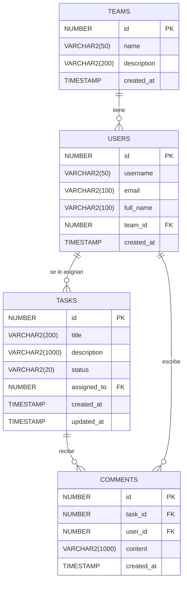

# Diagrama de Esquema — Lección 03

**Sistema de gestión de tareas (Task Management System)**
Versión base + extensión con `comments` (Ejercicio 1)

---

## Descripción del esquema

El sistema tiene tres tablas base definidas en `01_setup_schema.sql`:

- **`teams`**: los equipos de trabajo (Engineering, Product, etc.)
- **`users`**: los usuarios, cada uno pertenece a un equipo
- **`tasks`**: las tareas, cada una asignada a un usuario

El esquema se extiende en los ejercicios con una cuarta tabla:

- **`comments`**: comentarios sobre una tarea, hechos por un usuario

---

## Relaciones

- Un `team` tiene muchos `users` (one-to-many)
- Un `user` pertenece a un `team` (many-to-one)
- Un `user` tiene muchas `tasks` asignadas (one-to-many)
- Una `task` es asignada a un `user` (many-to-one)
- Una `task` tiene muchos `comments` (one-to-many)
- Un `comment` pertenece a una `task` y a un `user`

---

## Diagrama Mermaid

---

## Notas sobre el esquema

### Columna `status` en `tasks`
Los valores posibles según el seed data son: `'open'`, `'in_progress'`. En producción convendría agregar un CHECK constraint para limitar los valores válidos. El default es `'open'`.

### Identidad automática
Se usa `NUMBER GENERATED ALWAYS AS IDENTITY` (Oracle) que equivale a `SERIAL` en PostgreSQL o `AUTOINCREMENT` en SQLite. SQLAlchemy lo mapea como `Column(Integer, primary_key=True)` y maneja esto automáticamente según el dialecto.

### Cascade en `comments`
Si se borra una `task`, todos sus `comments` deberían borrarse en cascada (`ON DELETE CASCADE` en SQL, o `cascade="all, delete-orphan"` en el ORM). Si se borra un `user`, hay que decidir si los comentarios que escribió se borran o se preservan con el campo `user_id` en NULL (requeriría hacer la FK nullable).

### Timestamp `updated_at` en `tasks`
No tiene DEFAULT en el DDL original. En el ORM se puede manejar con `onupdate=datetime.utcnow` en SQLAlchemy para que se actualice automáticamente al modificar el registro.

---

## Datos de prueba (seed)

| Tabla | Datos |
|-------|-------|
| teams | Engineering (id=1), Product (id=2) |
| users | alice_dev→Engineering, bob_dev→Engineering, carol_pm→Product |
| tasks | "Fix login bug"→alice (open), "Design dashboard"→carol (in_progress), "Update deps"→bob (open) |
