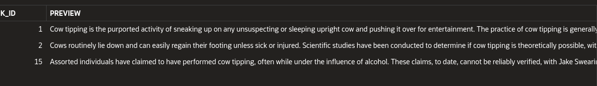

## Question results

#### How much force would requiere cow tipping?

The first two chunks shows information of hypothetical force that would requiere to tip a cow and how its impossible for human to accomplish that. Altought its not the first primary o the text cintents the answers to the question.

#### Why is cow tipping considered unlikely to happen in real life?

The chunks selected aproached to explain that cow tipping is considered an urban legend and the sources of evidence existing are no reliable. Therefore the reponse is correctly infered and it makes sense.

#### "What is the philosophy?"

We can see all responses are not related and have nothing to do with the question about philosophy.

